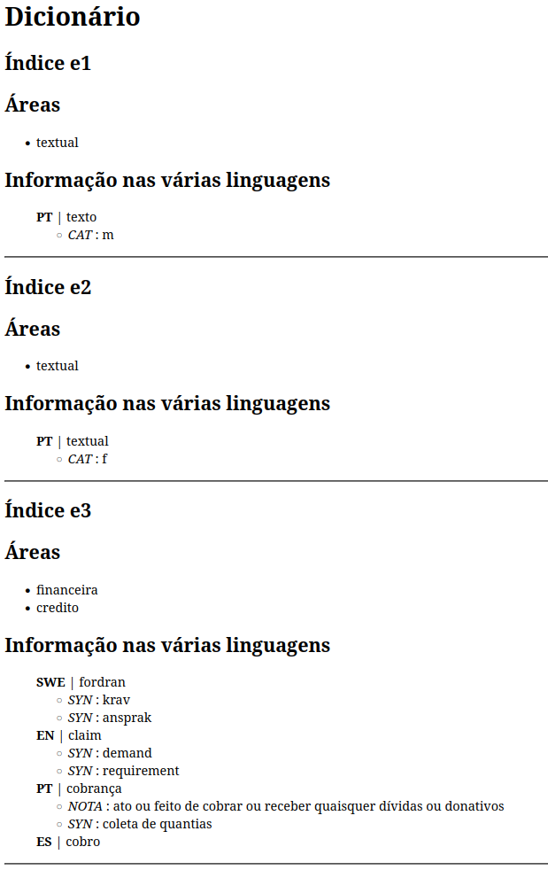
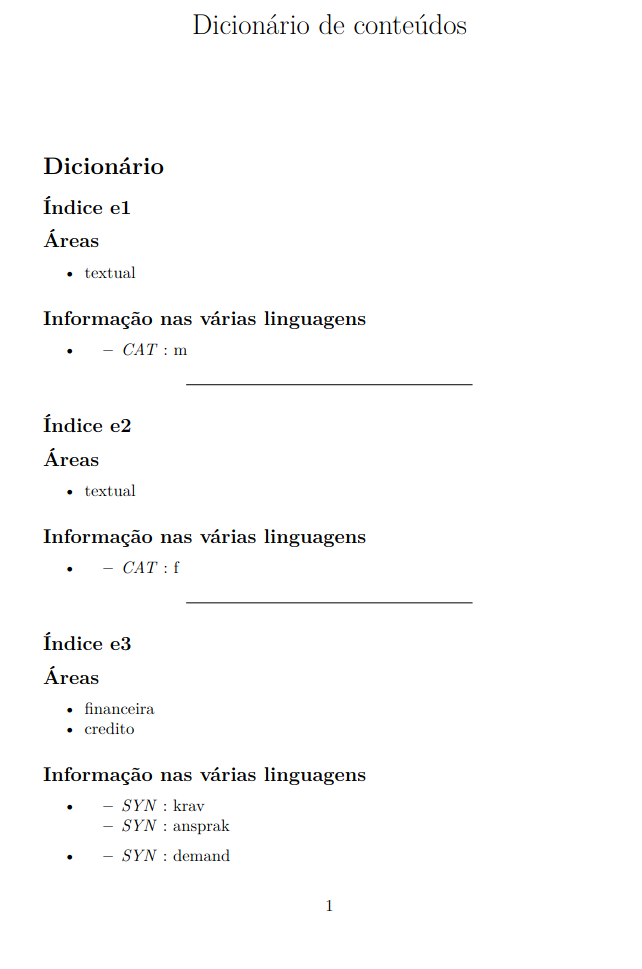

# Table of Contents

1.  [Resumo](#org4e00923)
2.  [Exemplo](#org1a9df00)
    1.  [Dicionário na linguagem criada](#org320a33a)
    2.  [Dicionário com vista HTML](#org1f0a786)
    3.  [Dicionário com vista PDF](#org201919c)

# Resumo

-   Neste TPC o objetivo era a criação de uma representação semântica do dicionário para se poder facilmente percorrer esta representação e criar várias vistas a partir do dicionário.

-   O ficheiro lex mantém-se igual ao do último TPC

-   O ficheiro yacc apenas é diferente na medida em que durante o reconhecimento da gramática é feita uma árvore abstrata sintática. A classe que representa esta árvore está definida no ficheiro **tree.py**. É ainda feita, por motivos de demonstrar as capacidades de conversões possíveis de realizar através da árvore, uma conversão de um ficheiro html e de um ficheiro pdf através do de html.

-   No ficheiro **html.py** encontra-se uma travessia na árvore que gera um ficheiro html resultante da árvore.

# Exemplo

## Dicionário na linguagem criada

    Indice:e1
    Areas:(area textual)
    Ling:
        (pt): texto | (cat m)
    
    Indice: e2
    Areas:(area textual)
    Ling:
        (pt): textual | (cat f)
    
    Indice: e3
    Areas: (area financeira) (area credito)
    Ling:
        (swe): fordran | (syn krav) (syn ansprak)
        (en): claim | (syn demand) (syn requirement)
        (pt): cobrança | (nota ato ou feito de cobrar ou receber quaisquer dívidas ou donativos) (syn coleta de quantias)
        (es): cobro

## Dicionário com vista HTML

    <!DOCTYPE html>
    <html>
        <head>
            <meta charset="UTF-8"/>
            <title>Dicionário de conteúdos</title>
        </head>
        <body>
    
                <h1> Dicionário </h1>
    
            <h2> Índice e1 </h2>
    
            <h2> Áreas </h2>
            <ul>
        <li> textual </li>
            </ul>
    
            <h2> Informação nas várias linguagens </h2>
            <ul>
    
            <b> PT </b> | texto
            <ul>
        <li> <i> CAT </i> : m </li>
            </ul>
    
            </ul>
    
                

    
            <h2> Índice e2 </h2>
    
            <h2> Áreas </h2>
            <ul>
        <li> textual </li>
            </ul>
    
            <h2> Informação nas várias linguagens </h2>
            <ul>
    
            <b> PT </b> | textual
            <ul>
        <li> <i> CAT </i> : f </li>
            </ul>
    
            </ul>
    
                

    
            <h2> Índice e3 </h2>
    
            <h2> Áreas </h2>
            <ul>
        <li> financeira </li><li> credito </li>
            </ul>
    
            <h2> Informação nas várias linguagens </h2>
            <ul>
    
            <b> SWE </b> | fordran
            <ul>
        <li> <i> SYN </i> : krav </li><li> <i> SYN </i> : ansprak </li>
            </ul>
    
            <b> EN </b> | claim
            <ul>
        <li> <i> SYN </i> : demand </li><li> <i> SYN </i> : requirement </li>
            </ul>
    
            <b> PT </b> | cobrança
            <ul>
        <li> <i> NOTA </i> : ato ou feito de cobrar ou receber quaisquer dívidas ou donativos </li><li> <i> SYN </i> : coleta de quantias </li>
            </ul>
    
            <b> ES </b> | cobro
            <ul>
    
            </ul>
    
            </ul>
    
                

    
        </body>

## Dicionário com vista PDF

